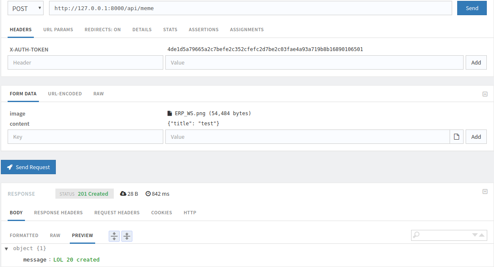

8lol
====

A Symfony project created on May 22, 2017, 11:44 pm.

## Installation

```bash
git clone https://github.com/pierreflaudias/9gag.git && cd 9gag
```

```bash
docker run -d \
    --volume /var/lib/mysql \
    --name data_mysql \
    --entrypoint /bin/echo \
    busybox "mysql data-only container"
```

```bash
docker run -d -p 3306 \
    --name mysql \
    --volumes-from data_mysql \
    -e MYSQL_USER=root \
    -e MYSQL_PASS=root \
    -e ON_CREATE_DB=8lol \
    tutum/mysql
```

```bash
composer install
```
In app/config/parameter.yml :
> Change database_port: docker mapped port (docker ps)

> Add this line -> memes_images_directory: '%kernel.root_dir%/../web/uploads/memes'
```
php bin/console doctrine:schema:update --force
php bin/console doctrine:fixtures:load
php bin/console server:start
```

Browse to : [http://localhost:8000/](http://localhost:8000/)

##### 2 accounts : admin/admin, test/test

## Tests

```bash
phpunit
```

## API routing
> If authentication is required : send HTTP Header ```"X-AUTH-TOKEN: user_token"```
> Token in menu "username" -> My account

### Group LOL

#### GET &nbsp;&nbsp;&nbsp;&nbsp;&nbsp;&nbsp;&nbsp;&nbsp;/api/
- Retrieve list of LOLs

#### GET &nbsp;&nbsp;&nbsp;&nbsp;&nbsp;&nbsp;&nbsp;&nbsp;/api/meme/{id}
- Retrieve LOL with id = {id}

#### POST &nbsp;&nbsp;&nbsp;&nbsp;&nbsp;/api/meme 
> authentication is required
- Create a LOL

A little bit difficult...

It works with Servistate (chrome extension)
Example : 

#### DELETE &nbsp;&nbsp;/api/meme/{id}/remove
> authentication is required
- Remove LOL with id = {id}

### Group Comment

#### POST &nbsp;&nbsp;&nbsp;&nbsp;&nbsp;/api/meme/{id}/comment
> authentication is required
- Create a comment for LOL with id = {id}
- Body :
    ```json
    {
        "content": "My comment"
    }
    ```
    
#### DELETE &nbsp;&nbsp;/api/meme/{id}/comment/{comment_id}
> authentication is required
- Remove a comment with id = {comment_id} for LOL with id = {id}

#### GET &nbsp;&nbsp;&nbsp;&nbsp;&nbsp;&nbsp;&nbsp;/api/meme/{id}/{note}
> authentication is required
- Note LOL with id = {id} and {note} = downvote | upvote

### Group User

#### POST &nbsp;&nbsp;&nbsp;&nbsp;&nbsp;/api/register
- Register a new user
- Body : 
    ```json
    {
        "username": "toto",
        "email": "toto@gmail.com",
        "password": "123456"
     }
     ```

#### GET &nbsp;&nbsp;&nbsp;&nbsp;&nbsp;&nbsp;&nbsp;/api/user
> authentication is required
- Retrieve information about user
